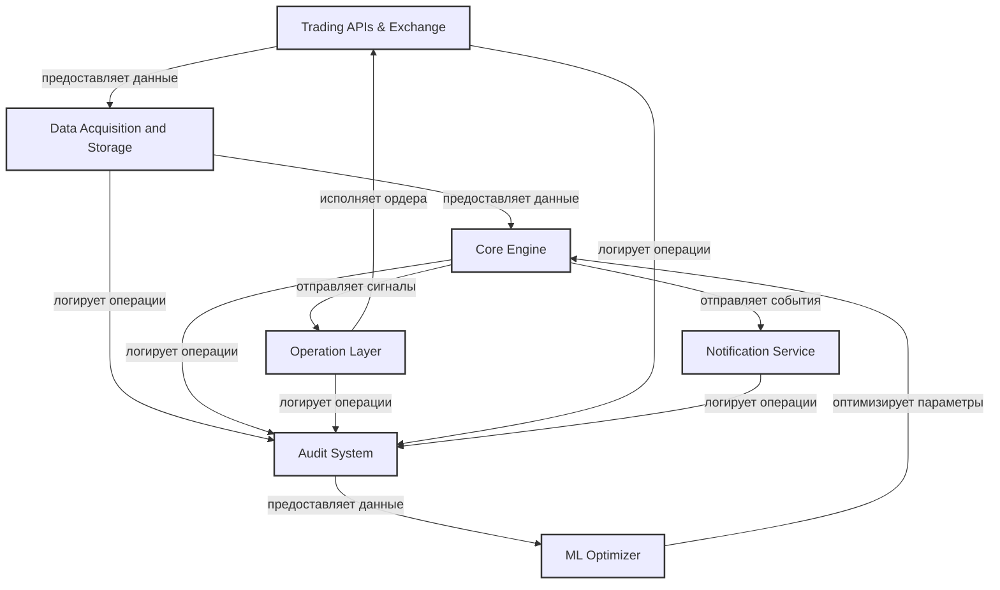

# VANTA: High-Level Design Architecture

## 1. Общее описание архитектуры

### 1.1 Архитектурный подход

VANTA представляет собой распределенную, модульную, событийно-ориентированную систему, построенную на микросервисной архитектуре с элементами реактивного программирования. Бот должен обрабатывать рыночные данные в реальном времени, применять сложную аналитику для выявления рыночных манипуляций и принимать торговые решения с минимальной задержкой.

Ключевые архитектурные принципы:

- **Модульность** — независимо разрабатываемые и тестируемые компоненты
- **Слабая связанность** — компоненты взаимодействуют через четко определенные интерфейсы
- **Высокая когезия** — каждый компонент отвечает за конкретную функцию
- **Реактивность** — асинхронная обработка данных и событий
- **Отказоустойчивость** — система продолжает функционировать при отказе отдельных компонентов
- **Масштабируемость** — горизонтальное масштабирование компонентов под нагрузкой
- **Обратная совместимость** — возможность обновления компонентов без остановки системы

### 1.2 Ключевые технологические характеристики

1. **Прямая обработка данных** — работа с рыночными данными без промежуточных слоев
2. **Complex Event Processing (CEP)** — выявление паттернов в реальном времени
3. **Time Series Analysis** — анализ временных рядов для определения контекста рынка
4. **Machine Learning** — оптимизация параметров и самообучение на основе результатов
5. **Rule Engine** — применение правил для фильтрации сигналов и принятия решений
6. **API Integration** — взаимодействие с биржевыми API и внешними сервисами
7. **State Management** — управление состоянием системы и торговыми позициями
8. **Monitoring & Alerting** — комплексный мониторинг и оповещение о критических событиях

## 2. Архитектурная диаграмма высокого уровня




### 2.1 Ключевые потоки данных

1. **Trading APIs & Exchange -> Data Acquisition and Storage:**
   - Поток рыночных данных (OHLCV, стакан, OI)
   - События о ликвидациях
   - Информация о сделках
   - Статус ордеров

2. **Data Acquisition and Storage -> Core Engine:**
   - Обработанные рыночные данные
   - Нормализованные временные ряды
   - Обогащенные метрики
   - Кешированные данные

3. **Core Engine -> Operation Layer:**
   - Торговые сигналы
   - Рекомендации по позициям
   - Оценки рисков
   - Контекст рынка

4. **Operation Layer -> Trading APIs & Exchange:**
   - Торговые ордера
   - Запросы на исполнение
   - Управление позициями
   - Отмена ордеров

5. **Все компоненты -> Audit System:**
   - События и действия
   - Метрики производительности
   - Результаты операций
   - Системные логи

6. **Audit System -> ML Optimizer:**
   - Данные для обучения
   - Метрики эффективности
   - Результаты A/B тестов
   - Исторические паттерны

7. **ML Optimizer -> Core Engine:**
   - Оптимизированные параметры
   - Рекомендации по стратегиям
   - Оценки эффективности
   - Адаптивные настройки

8. **Core Engine -> Notification Service:**
   - События детекции
   - Изменения контекста
   - Торговые сигналы
   - Системные уведомления

### 2.2 Описание ключевых компонентов

1. **Data Acquisition and Storage** — сбор, обработка и хранение рыночных данных
   - **Market Data Collector** — получение данных с бирж через REST и WebSocket
   - **Data Normalizer** — преобразование данных в единый формат
   - **Data Enricher** — обогащение данных дополнительными метриками
   - **Time Series Storage** — хранение и индексация временных рядов
   - **Cache Manager** — кеширование актуальных данных для быстрого доступа

1.2 Обоснование выделения в отдельный сервис

**Повышение отказоустойчивости:**
- Независимый сбор данных при сбоях основного бота
- Буферизация данных при временной недоступности
- Автоматическое восстановление соединений

**Масштабируемость:**
- Горизонтальное масштабирование сбора данных
- Оптимизация под конкретные типы данных
- Независимое масштабирование хранилищ

**Управление API-лимитами:**
- Централизованный контроль запросов
- Оптимизация использования квот
- Предотвращение блокировок

**Переиспользование данных:**
- Единый источник данных для всех компонентов
- Возможность интеграции с внешними системами
- Поддержка различных форматов данных

#### 1.2.1 Техническая реализация

**Архитектура сервиса:**
```
+------------------------------------------+
|        Data Acquisition Service          |
+------------------------------------------+
|                                          |
|  +------------+        +-------------+   |
|  |   Market   |        |    Data     |   |
|  |   Data     |------->|  Normalizer |   |
|  | Collector  |        |             |   |
|  +------------+        +-------------+   |
|        |                      |          |
|        v                      v          |
|  +------------+        +-------------+   |
|  | WebSocket  |        |    Data     |   |
|  | Manager    |------->|   Enricher  |   |
|  |            |        |             |   |
|  +------------+        +-------------+   |
|                               |          |
|                               v          |
|                        +-------------+   |
|                        |   Time      |   |
|                        |   Series    |   |
|                        |   Storage   |   |
|                        |             |   |
|                        +-------------+   |
|                               |          |
|                               v          |
|                        +-------------+   |
|                        |    Cache    |   |
|                        |   Manager   |   |
|                        |             |   |
|                        +-------------+   |
|                                          |
+------------------------------------------+
```

**Технологический стек:**
- **Основной язык**: Python 3.10+
- **API Framework**: FastAPI
- **База данных**: 
  - InfluxDB/TimescaleDB для временных рядов
  - Redis для кеширования
  - PostgreSQL для метаданных
- **Асинхронная обработка**: asyncio
- **Очереди сообщений**: Redis Pub/Sub
- **Мониторинг**: Prometheus + Grafana

**Механизм сбора данных:**
1. **REST API:**
   - Периодический опрос исторических данных
   - Получение статических данных
   - Управление ордерами

2. **WebSocket:**
   - Реалтайм обновления рыночных данных
   - События о сделках и ордерах
   - Информация о ликвидациях
   **WebSocket API:**
```python
# Каналы подписки
ws://api/v1/ws/market/ohlcv/{symbol}/{timeframe}
ws://api/v1/ws/market/orderbook/{symbol}
ws://api/v1/ws/market/trades/{symbol}
ws://api/v1/ws/market/oi/{symbol}
ws://api/v1/ws/market/liquidations/{symbol}
```
2. **Core Engine** — основная бизнес-логика системы
   - **Context Analyzer** — определение рыночного контекста и режима
   - **Manipulation Detectors** — система из 22 детекторов манипуляций
   - **Strategy Manager** — управление стратегиями входа/выхода
   - **Decision Engine** — принятие торговых решений
   - **Risk Manager** — управление рисками и позициями

3. **Operation Layer** — операционное управление системой
   - **Order Manager** — управление торговыми ордерами
   - **Position Tracker** — отслеживание открытых позиций
   - **Performance Monitor** — мониторинг производительности системы
   - **Alert System** — система оповещений о критических событиях
   - **Admin Dashboard** — административная панель управления

4. **Trading APIs & Exchange** — единый компонент для взаимодействия с биржами
   - **API Client** — абстрактные интерфейсы для работы с биржами
   - **Exchange Implementations** — реализации для конкретных бирж (Bybit, Binance и др.)
   - **Rate Limiter** — контроль частоты запросов
   - **Failover Manager** — механизм переключения при сбоях API
   - **WebSocket Manager** — управление WebSocket-соединениями

5. **Notification Service** — управление и доставка уведомлений
   - **Notification Manager** — центральный узел обработки и фильтрации уведомлений
   - **Message Formatter** — форматирование сообщений для различных типов уведомлений
   - **Telegram Connector** — взаимодействие с Telegram Bot API
   - **Notification History** — хранение истории отправленных уведомлений
   - **User Preferences** — управление настройками уведомлений пользователей

6. **Audit System** — система аудита и анализа операций
   - **Event Logger** — запись всех системных событий
   - **Decision Tracker** — отслеживание торговых решений
   - **Performance Analyzer** — анализ эффективности операций
   - **Compliance Monitor** — контроль соответствия требованиям
   - **ML Training Data Collector** — сбор данных для обучения ML

7. **ML Optimizer** — оптимизация параметров и адаптация стратегий
   - **Parameter Optimizer** — оптимизация параметров детекторов
   - **Pattern Analyzer** — анализ эффективности паттернов
   - **Context Learner** — обучение на контекстных данных
   - **Performance Evaluator** — оценка эффективности решений
   - **A/B Testing Manager** — управление тестированием изменений

**Типы уведомлений:**
1. **Рыночный контекст** - уведомления об изменении режима рынка (импульсный, боковик и т.д.)
2. **Торговые сигналы** - рекомендации о входе/выходе из позиций
3. **Детекция манипуляций** - обнаружение подозрительной активности на рынке
4. **Статус позиций** - обновления о текущих позициях (прибыль/убыток)
5. **Системные уведомления** - технические сообщения о работе бота

### 2.3 Описание ключевых компонентов

1. **Data Acquisition and Storage** — сбор, обработка и хранение рыночных данных
   - **Market Data Collector** — получение данных с бирж через REST и WebSocket
   - **Data Normalizer** — преобразование данных в единый формат
   - **Data Enricher** — обогащение данных дополнительными метриками
   - **Time Series Storage** — хранение и индексация временных рядов
   - **Cache Manager** — кеширование актуальных данных для быстрого доступа

2. **Core Engine** — основная бизнес-логика системы
   - **Context Analyzer** — определение рыночного контекста и режима
   - **Manipulation Detectors** — система из 22 детекторов манипуляций
   - **Strategy Manager** — управление стратегиями входа/выхода
   - **Decision Engine** — принятие торговых решений
   - **Risk Manager** — управление рисками и позициями

3. **Operation Layer** — операционное управление системой
   - **Order Manager** — управление торговыми ордерами
   - **Position Tracker** — отслеживание открытых позиций
   - **Performance Monitor** — мониторинг производительности системы
   - **Alert System** — система оповещений о критических событиях
   - **Admin Dashboard** — административная панель управления

4. **Trading APIs & Exchange** — единый компонент для взаимодействия с биржами
   - **API Client** — абстрактные интерфейсы для работы с биржами
   - **Exchange Implementations** — реализации для конкретных бирж (Bybit, Binance и др.)
   - **Rate Limiter** — контроль частоты запросов
   - **Failover Manager** — механизм переключения при сбоях API
   - **WebSocket Manager** — управление WebSocket-соединениями

5. **Notification Service** — управление и доставка уведомлений
   - **Notification Manager** — центральный узел обработки и фильтрации уведомлений
   - **Message Formatter** — форматирование сообщений для различных типов уведомлений
   - **Telegram Connector** — взаимодействие с Telegram Bot API
   - **Notification History** — хранение истории отправленных уведомлений
   - **User Preferences** — управление настройками уведомлений пользователей

6. **Audit System** — система аудита и анализа операций
   - **Event Logger** — запись всех системных событий
   - **Decision Tracker** — отслеживание торговых решений
   - **Performance Analyzer** — анализ эффективности операций
   - **Compliance Monitor** — контроль соответствия требованиям
   - **ML Training Data Collector** — сбор данных для обучения ML

7. **ML Optimizer** — оптимизация параметров и адаптация стратегий
   - **Parameter Optimizer** — оптимизация параметров детекторов
   - **Pattern Analyzer** — анализ эффективности паттернов
   - **Context Learner** — обучение на контекстных данных
   - **Performance Evaluator** — оценка эффективности решений
   - **A/B Testing Manager** — управление тестированием изменений

### 2.4 Контракты компонентов

#### 2.4.1 Data Acquisition and Storage

**Входы:**
- Конфигурация подключения к бирже (API ключи, URL, параметры)
- Настройки сбора данных (тикеры, таймфрейм, типы данных)
- Команды управления (старт/стоп сбора, синхронизация исторических данных)

**Выходы (API):**
- Получение OHLCV данных по инструменту и таймфрейму
- Получение данных открытого интереса (OI)
- Получение данных стакана (order book)
- Получение информации о ликвидациях
- Получение дельты (агрессивные покупки/продажи)
- События об обновлении данных (для реактивных компонентов)

**Внутренние функции:**
- Подключение к API биржи (REST и WebSocket)
- Нормализация и обогащение данных
- Хранение в оптимизированной Time Series DB
- Кеширование актуальных данных для быстрого доступа
- Мониторинг состояния соединения и качества данных

#### 2.4.2 Core Engine

**Входы:**
- Рыночные данные от Data Acquisition and Storage
- Конфигурация стратегий и детекторов
- Сигналы от Operation Layer о состоянии позиций

**Выходы:**
- Сигналы на открытие/закрытие позиций
- Результаты анализа рыночного контекста
- Обнаруженные манипуляции
- Оценки рисков

**Внутренние функции:**
- Анализ рыночного контекста
- Детекция манипуляций
- Управление стратегиями
- Оценка рисков
- Принятие торговых решений

#### 2.4.3 Operation Layer

**Входы:**
- Торговые сигналы от Core Engine
- Состояние рынка от Data Acquisition and Storage
- Конфигурация торговых параметров
- Статус соединения с биржами от Trading APIs & Exchange

**Выходы:**
- Торговые ордера через Trading APIs & Exchange
- Статус позиций
- Метрики производительности
- Оповещения о критических событиях

**Внутренние функции:**
- Управление ордерами через Trading APIs & Exchange
- Отслеживание исполнения ордеров
- Мониторинг позиций
- Управление рисками
- Обработка ошибок исполнения

**Взаимодействие с Trading APIs & Exchange:**
- Использование унифицированного интерфейса для работы с биржами
- Управление торговыми операциями
- Обработка ответов от бирж
- Контроль состояния соединения
- Валидация торговых операций

**Механизмы отказоустойчивости:**
- Автоматическое восстановление после сбоев
- Повторные попытки исполнения ордеров
- Валидация состояния перед исполнением
- Мониторинг качества соединения
- Обработка таймаутов и ошибок

#### 2.4.4 Notification Service

**Входы:**
- События от Core Engine (изменение контекста рынка, детекция манипуляций)
- События от Operation Layer (рекомендации по сделкам, статус позиций)
- Настройки пользователей по уведомлениям
- Системные события (сбои, изменения в работе системы)

**Выходы:**
- Уведомления в Telegram
- Записи в журнал уведомлений
- Метрики использования (статистика отправленных уведомлений)

**Внутренние функции:**
- Фильтрация и приоритизация уведомлений
- Форматирование сообщений по шаблонам
- Асинхронная отправка уведомлений
- Отслеживание доставки сообщений
- Управление пользовательскими настройками

#### 2.4.5 Взаимодействие Data Acquisition and Storage с Trading APIs & Exchange

**Основные принципы взаимодействия:**
- Trading APIs & Exchange является первичным источником данных для Data Acquisition and Storage
- Взаимодействие происходит через унифицированный интерфейс
- Поддержка как REST API, так и WebSocket соединений
- Обработка ошибок и повторные попытки на уровне Trading APIs & Exchange

**Потоки данных:**

1. **Trading APIs & Exchange -> Data Acquisition and Storage:**
   - Рыночные данные (OHLCV, стакан, OI)
   - События о ликвидациях
   - Информация о сделках
   - Статус ордеров
   - Метаданные биржи

2. **Data Acquisition and Storage -> Trading APIs & Exchange:**
   - Запросы на получение исторических данных
   - Запросы на подписку к WebSocket каналам
   - Запросы на получение метаданных
   - Запросы на валидацию данных

**Механизмы взаимодействия:**

1. **REST API:**
   - Синхронные запросы для получения исторических данных
   - Запросы метаданных и конфигурации
   - Управление подписками

2. **WebSocket:**
   - Асинхронная подписка на рыночные данные
   - Получение реалтайм обновлений
   - Управление соединением

**Обработка ошибок:**
- Автоматические повторные попытки при сбоях
- Логирование ошибок и метрик
- Уведомления о проблемах с соединением
- Механизмы восстановления после сбоев

**Оптимизация производительности:**
- Кеширование часто запрашиваемых данных
- Батчинг запросов
- Контроль rate limits
- Приоритизация критических данных

#### 2.4.6 Audit System

**Входы:**
- События от Core Engine (сигналы, детекция манипуляций)
- Данные от Operation Layer (ордера, позиции, P&L)
- События от Data Acquisition and Storage (рыночные данные)
- Системные события (ошибки, предупреждения)
- Пользовательские действия (настройки, конфигурации)

**Выходы:**
- Аудиторские отчеты
- Аналитика эффективности
- Данные для обучения ML
- Предупреждения о несоответствиях
- Метрики производительности

**Внутренние функции:**
- Запись и индексация событий
- Анализ паттернов принятия решений
- Оценка эффективности стратегий
- Контроль соответствия требованиям
- Подготовка данных для ML

#### 2.4.7 ML Optimizer

**Входы:**
- Данные о результатах детекции манипуляций
- Метрики эффективности торговых решений
- Контекстные данные о состоянии рынка
- Результаты аудита операций
- Исторические данные о сделках

**Выходы:**
- Оптимизированные параметры детекторов
- Рекомендации по адаптации стратегий
- Оценки эффективности паттернов
- Результаты A/B тестирования
- Метрики улучшения производительности

**Внутренние функции:**
- Анализ эффективности детекторов
- Оптимизация параметров стратегий
- Обучение на исторических данных
- Управление A/B тестированием
- Оценка качества предсказаний

#### 2.4.8 Система логгирования

**Общий подход:**
Для MVP версии VANTA реализована упрощенная система логгирования, которая обеспечивает базовый мониторинг и отладку системы. Основные принципы:

1. **Локальное логгирование:**
   - Каждый модуль/сервис использует собственный логгер
   - Логи записываются в файлы и консоль
   - Критические ошибки отправляются в Telegram

2. **Структура системы логгирования:**
   ```
   logging/
   ├── setup_logger.py      # Настройка логгеров
   ├── telegram_handler.py  # Обработчик для Telegram
   └── loggers/
       ├── data_acquisition.log
       ├── core_engine.log
       ├── operation_layer.log
       └── trading_api.log
   ```

3. **Уровни логгирования:**
   - **ERROR**: Критические ошибки, требующие немедленного внимания
     - Сбои в работе API биржи
     - Ошибки исполнения ордеров
     - Проблемы с подключением к базе данных
     - Отправляются в Telegram

   - **WARNING**: Предупреждения и потенциальные проблемы
     - Высокая задержка API
     - Подозрительные паттерны в данных
     - Необычные объемы торгов
     - Записываются в файлы

   - **INFO**: Важные операционные события
     - Запуск/остановка компонентов
     - Открытие/закрытие позиций
     - Изменение состояния системы
     - Записываются в файлы

   - **DEBUG**: Подробная информация для отладки
     - Детали обработки данных
     - Промежуточные результаты анализа
     - Метрики производительности
     - Записываются в файлы при включенном режиме отладки

4. **Интеграция с сервисами:**
   - Каждый сервис использует свой логгер с уникальным именем
   - Единый формат логов для всех компонентов:
     ```
     [TIMESTAMP] [LEVEL] [MODULE] [FUNCTION] - Message
     ```
   - Важные события отправляются в Telegram через TelegramHandler

5. **Пример использования:**
   ```python
   # Пример настройки логгера в модуле
   from utils.logger import setup_logger
   from utils.telegram_notifier import TelegramHandler
   import logging
   
   # Настройка логгера
   logger = setup_logger(__name__)
   
   # Добавление Telegram-обработчика для критических ошибок
   telegram_handler = TelegramHandler(
       bot_token="YOUR_BOT_TOKEN",
       chat_id="YOUR_CHAT_ID",
       level=logging.ERROR
   )
   logger.addHandler(telegram_handler)
   
   def process_data():
       try:
           logger.info("Starting data processing")
           # Бизнес-логика
           logger.debug("Processing step 1 completed")
           # Еще код
           logger.info("Data processing completed successfully")
       except Exception as e:
           # Критическая ошибка будет отправлена в Telegram
           logger.error(f"Error processing data: {str(e)}", exc_info=True)
           raise
   ```

6. **Планы по расширению:**
   В будущих версиях система логгирования будет расширена следующими возможностями:
   - Ротация логов для управления размером файлов
   - Структурированное логгирование в формате JSON
   - Централизованное хранение логов (ELK Stack)
   - Распределенная трассировка запросов между сервисами
   - Интеграция с системами мониторинга (Prometheus/Grafana)
   - Расширенная аналитика логов

## 3. Технологический стек и рекомендуемые подходы

### 3.1 Базовые технологии

| Компонент | Рекомендуемые технологии | Обоснование |
|-----------|--------------------------|-------------|
| **Основной язык программирования** | Python 3.10+ | Богатая экосистема для анализа данных, ML и алготрейдинга, высокая скорость разработки |
| **Асинхронная обработка** | asyncio | Эффективная обработка асинхронных операций без промежуточных слоев |
| **Time Series Database** | InfluxDB/TimescaleDB | Оптимизирована для временных рядов, высокая скорость записи/чтения, сжатие данных |
| **State Management** | Redis | In-memory хранилище для быстрого доступа к состоянию, pub/sub функциональность |
| **ML Framework** | Python (scikit-learn, PyTorch) | Гибкость, производительность, широкие возможности для различных алгоритмов |
| **API Gateway** | FastAPI | Асинхронность, автоматическая документация, высокая производительность |
| **Контейнеризация** | Docker + Kubernetes | Изоляция, масштабируемость, оркестрация контейнеров |
| **CI/CD** | GitHub Actions/GitLab CI | Автоматизация сборки, тестирования и деплоя |
| **Мониторинг** | Prometheus + Grafana | Сбор метрик, визуализация, алертинг |
| **Логирование** | ELK Stack (Elasticsearch, Logstash, Kibana) | Централизованное хранение и анализ логов |
| **Notification System** | aiogram | Асинхронная библиотека для Telegram Bot API, высокая производительность |

### 3.2 Компонентная архитектура в деталях

#### 3.2.1 Data Acquisition and Storage

```
+------------------------------------------+
|        Data Acquisition and Storage      |
+------------------------------------------+
|                                          |
|  +------------+        +-------------+   |
|  |   Market   |        |    Data     |   |
|  |   Data     |------->|  Normalizer |   |
|  | Collector  |        |             |   |
|  +------------+        +-------------+   |
|        |                      |          |
|        v                      v          |
|  +------------+        +-------------+   |
|  | WebSocket  |        |    Data     |   |
|  | Manager    |------->|   Enricher  |   |
|  |            |        |             |   |
|  +------------+        +-------------+   |
|                               |          |
|                               v          |
|                        +-------------+   |
|                        |   Time      |   |
|                        |   Series    |   |
|                        |   Storage   |   |
|                        |             |   |
|                        +-------------+   |
|                               |          |
|                               v          |
|                        +-------------+   |
|                        |    Cache    |   |
|                        |   Manager   |   |
|                        |             |   |
|                        +-------------+   |
|                                          |
+------------------------------------------+
```

**Технологии и подходы:**
- **Market Data Collector**: Python + aiohttp/requests для REST API, websockets для WebSocket
- **WebSocket Manager**: asyncio для асинхронной обработки соединений, backoff для повторных подключений
- **Data Normalizer**: Pandas для обработки данных, Pydantic для валидации схем
- **Data Enricher**: numba/Cython для вычислительно интенсивных операций
- **Time Series Storage**: InfluxDB/TimescaleDB для хранения временных рядов
- **Cache Manager**: Redis для кеширования актуальных данных

#### 3.2.2 Core Engine

```
+----------------------------------------------------------+
|                       Core Engine                         |
+----------------------------------------------------------+
|                                                          |
|  +----------------+        +---------------------+       |
|  |    Context     |        |   Manipulation      |       |
|  |    Analyzer    |------->|     Detectors       |       |
|  |                |        |                     |       |
|  +----------------+        +---------------------+       |
|         ^                           |                    |
|         |                           v                    |
|  +----------------+        +---------------------+       |
|  |     Risk       |<-------|     Strategy        |       |
|  |    Manager     |        |      Manager        |       |
|  |                |        |                     |       |
|  +----------------+        +---------------------+       |
|         |                           ^                    |
|         v                           |                    |
|  +----------------+        +---------------------+       |
|  |    Decision    |<------>|     ML Optimizer    |       |
|  |     Engine     |        |                     |       |
|  |                |        |                     |       |
|  +----------------+        +---------------------+       |
|         |                                                |
+----------------------------------------------------------+
          |
          v
    To Operation Layer
```

**Технологии и подходы:**
- **Context Analyzer**: statsmodels для статистического анализа, TA-Lib для технических индикаторов
- **Manipulation Detectors**: Rule Engine (pyKnow/Durable Rules) для правил детекции
- **Strategy Manager**: Паттерн Strategy для различных стратегий, Factory для создания
- **Risk Manager**: Собственная реализация на Python с транзакционными гарантиями
- **Decision Engine**: Actor model (pyactor) для изоляции принятия решений
- **ML Optimizer**: scikit-learn для классических алгоритмов, PyTorch для DL, optuna для оптимизации гиперпараметров

#### 3.2.3 Operation Layer

```
+----------------------------------------------------------+
|                     Operation Layer                       |
+----------------------------------------------------------+
|                                                          |
|  +----------------+        +---------------------+       |
|  |     Order      |        |     Position        |       |
|  |    Manager     |<------>|      Tracker        |       |
|  |                |        |                     |       |
|  +----------------+        +---------------------+       |
|         |                           |                    |
|         v                           v                    |
|  +----------------+        +---------------------+       |
|  |  Performance   |        |       Alert         |       |
|  |    Monitor     |------->|      System         |       |
|  |                |        |                     |       |
|  +----------------+        +---------------------+       |
|         ^                           |                    |
|         |                           v                    |
|  +----------------+        +---------------------+       |
|  |    Reporting   |        |       Admin         |       |
|  |     Service    |<-------|      Dashboard      |       |
|  |                |        |                     |       |
|  +----------------+        +---------------------+       |
|                                                          |
+----------------------------------------------------------+
```

**Технологии и подходы:**
- **Order Manager**: SAGA паттерн для транзакционности, Redis для кеширования состояния ордеров
- **Position Tracker**: Cassandra/ScyllaDB для хранения истории позиций
- **Performance Monitor**: Prometheus для метрик, Grafana для визуализации
- **Alert System**: Telegram API для оповещений
- **Reporting Service**: Pandas для анализа, Matplotlib/Plotly для визуализации
- **Admin Dashboard**: FastAPI + React для административного интерфейса

#### 3.2.4 Notification Service

```
+----------------------------------------------------------+
|                    Notification Service                   |
+----------------------------------------------------------+
|                                                          |
|  +----------------+        +---------------------+       |
|  |  Notification  |        |     Message         |       |
|  |   Manager      |------->|     Formatter       |       |
|  |                |        |                     |       |
|  +----------------+        +---------------------+       |
|         ^                           |                    |
|         |                           v                    |
|  +----------------+        +---------------------+       |
|  |     User       |        |     Telegram        |       |
|  |   Preferences  |<-------|     Connector       |       |
|  |                |        |                     |       |
|  +----------------+        +---------------------+       |
|         |                           |                    |
|         v                           v                    |
|  +----------------+        +---------------------+       |
|  | Notification   |<-------|      Message        |       |
|  |    History     |        |      Queue          |       |
|  |                |        |                     |       |
|  +----------------+        +---------------------+       |
|                                                          |
+----------------------------------------------------------+
```

**Технологии и подходы:**
- **Notification Manager**: Асинхронная обработка событий на основе Python asyncio
- **Message Formatter**: Jinja2 для шаблонизации сообщений
- **Telegram Connector**: API библиотека aiogram для взаимодействия с Telegram Bot API
- **User Preferences**: Redis для хранения настроек пользователей
- **Notification History**: Хранение в MongoDB/PostgreSQL для последующего анализа
- **Message Queue**: Redis Pub/Sub для асинхронной обработки сообщений

### 3.3 Хранилища данных

```
+----------------------------------------------------------+
|                      Data Storage                         |
+----------------------------------------------------------+
|                                                          |
|  +----------------+        +---------------------+       |
|  |  Time Series   |        |       State         |       |
|  |   Database     |        |       Store         |       |
|  | (InfluxDB/     |        |      (Redis)        |       |
|  |  TimescaleDB)  |        |                     |       |
|  +----------------+        +---------------------+       |
|                                                          |
|  +----------------+        +---------------------+       |
|  |   Analysis     |        |        Log          |       |
|  |   Results      |        |      Storage        |       |
|  |    Store       |        |   (Elasticsearch)   |       |
|  | (MongoDB)      |        |                     |       |
|  +----------------+        +---------------------+       |
|                                                          |
+----------------------------------------------------------+
```

**Технологии и подходы:**
- **Time Series Database**: InfluxDB/TimescaleDB для хранения OHLCV, OpenInterest и других временных рядов
- **State Store**: Redis для состояния системы, активных позиций и кеширования
- **Analysis Results Store**: MongoDB для хранения результатов детекции и анализа
- **Log Storage**: Elasticsearch для хранения и поиска логов, Kibana для визуализации

## 4. Обоснование архитектурных решений

### 4.1 Микросервисная архитектура

**Обоснование:**
- **Независимая разработка и деплой** — возможность обновлять отдельные компоненты без остановки всей системы
- **Изоляция отказов** — сбой в одном сервисе не влияет на работу всей системы
- **Технологическая гибкость** — возможность использовать оптимальные технологии для каждого компонента
- **Масштабируемость** — горизонтальное масштабирование отдельных компонентов под нагрузкой

**Применение в VANTA:**
- Детекторы манипуляций реализованы как отдельные сервисы, что позволяет:
  - Независимо обновлять и улучшать алгоритмы детекции
  - Масштабировать вычислительно интенсивные детекторы
  - Добавлять новые детекторы без изменения существующего кода

### 4.2 Событийно-ориентированная архитектура (Event-Driven Architecture)

**Обоснование:**
- **Реактивность** — моментальная реакция на изменения рыночных данных
- **Слабая связанность** — компоненты взаимодействуют через события, не зная друг о друге
- **Асинхронность** — параллельная обработка данных без блокировок
- **Масштабируемость** — легкое добавление новых потребителей событий

**Применение в VANTA:**
- Система реагирует на различные типы событий:
  - Рыночные события (изменение цены, объема, дельты)
  - События детекторов (обнаружение манипуляции)
  - События контекста (смена режима рынка)
  - Торговые события (открытие/закрытие позиций)

### 4.3 Реактивная архитектура

**Обоснование:**
- **Отзывчивость** — система всегда отвечает своевременно
- **Устойчивость** — система остается отзывчивой при отказах
- **Эластичность** — система остается отзывчивой под нагрузкой
- **Message-driven** — асинхронная передача сообщений между компонентами

**Применение в VANTA:**
- Асинхронная обработка рыночных данных
- Механизмы восстановления после сбоев
- Динамическое масштабирование компонентов под нагрузкой

### 4.4 Time Series Analysis Architecture

**Обоснование:**
- **Специализация** — оптимизация для работы с временными рядами
- **Производительность** — высокая скорость чтения/записи временных данных
- **Сжатие** — эффективное хранение больших объемов данных
- **Аналитика** — специализированные функции для анализа временных рядов

**Применение в VANTA:**
- Хранение и анализ исторических OHLCV данных
- Анализ контекста рынка на основе временных паттернов
- Расчет технических индикаторов и метрик

## 5. Масштабируемость и отказоустойчивость

### 5.1 Стратегия масштабирования

| Компонент | Стратегия масштабирования | Механизм |
|-----------|---------------------------|----------|
| **Data Acquisition and Storage** | Горизонтальное масштабирование | Партиционирование по инструментам/биржам |
| **Core Engine** | Вертикальное + горизонтальное | Разделение по типам детекторов и стратегий |
| **Operation Layer** | Горизонтальное | Шардирование по пользователям/аккаунтам |

### 5.2 Отказоустойчивость

| Тип отказа | Механизм защиты | Решение |
|------------|-----------------|---------|
| **Сбой API биржи** | Circuit Breaker | Временная блокировка запросов, переход в режим мониторинга |
| **Потеря соединения** | Reconnection + Backoff | Автоматические повторные подключения с увеличивающимся интервалом |
| **Отказ сервиса** | Service Redundancy | Запуск нескольких экземпляров сервиса с балансировкой нагрузки |
| **Потеря данных** | Data Replication | Репликация данных между несколькими узлами |
| **Inconsistent State** | SAGA Pattern | Распределенные транзакции с компенсирующими действиями |

## 6. Расширяемость и интеграция

### 6.1 Расширяемость

**Механизмы расширения:**
- **Plugin Architecture** — добавление новых детекторов манипуляций через плагины
- **Strategy Pattern** — добавление новых торговых стратегий
- **Adapter Pattern** — добавление поддержки новых бирж
- **Feature Flags** — управление включением/выключением функций

### 6.2 Интеграции

| Система | Тип интеграции | Технология |
|---------|----------------|------------|
| **Биржевые API** | REST + WebSocket | HTTP/WS клиенты с аутентификацией |
| **Telegram** | Bot API | Первичный канал уведомлений, двусторонняя коммуникация с пользователями |
| **Email** | SMTP | Для отчетов и критических уведомлений |
| **Внешние сигналы** | Webhooks | Для интеграции с внешними источниками сигналов |
| **Внешние ML-модели** | REST API | Для интеграции с развернутыми моделями |

## 7. Предположения и ограничения

### 7.1 Предположения

1. **Доступность данных** — предполагается, что необходимые рыночные данные доступны через API биржи
2. **Стабильность соединения** — предполагается наличие стабильного интернет-соединения с низкой задержкой
3. **Вычислительные ресурсы** — предполагается достаточность вычислительных ресурсов для анализа данных в реальном времени
4. **Задержка API** — предполагается, что задержка API биржи не превышает критических значений для стратегии

### 7.2 Ограничения

1. **Rate Limits** — API биржи имеют ограничения на количество запросов, что может влиять на частоту обновления данных
2. **Latency** — задержка в получении данных и исполнении ордеров может влиять на эффективность стратегии
3. **Execution Guarantee** — нет 100% гарантии исполнения ордеров по заданной цене
4. **API Availability** — возможны периоды недоступности API биржи
5. **Market Liquidity** — ограниченная ликвидность может влиять на исполнение ордеров и проскальзывание

## 8. Безопасность и соответствие требованиям

### 8.1 Безопасность

| Аспект | Механизм | Технология |
|--------|----------|------------|
| **API Keys** | Шифрование + Vault | HashiCorp Vault для хранения ключей |
| **Аутентификация** | OAuth2 + JWT | Для административного доступа |
| **HTTPS** | TLS 1.3 | Для всех внешних коммуникаций |
| **Логирование** | Audit Logging | Для отслеживания всех действий |
| **Isolation** | Network Policies | Ограничение взаимодействия между сервисами |
| **Аудит** | Immutable Logging | Защищенное хранение логов аудита |

### 8.2 Мониторинг и алертинг

| Тип мониторинга | Метрики | Технология |
|-----------------|---------|------------|
| **Performance** | Latency, Throughput | Prometheus + Grafana |
| **Ресурсы** | CPU, Memory, Disk | Prometheus + Node Exporter |
| **Бизнес-метрики** | P&L, Win Rate, Sharp Ratio | Custom Dashboard |
| **Доступность** | Uptime, Error Rate | Prometheus Alertmanager |
| **API Status** | Rate Limits, Latency | Custom Probes |

### 8.3 Система аудита

**Ключевые аспекты:**
1. **Неизменяемость логов:**
   - Криптографическое хеширование записей
   - Временные метки с использованием блокчейна
   - Защита от модификации данных

2. **Полнота аудита:**
   - Запись всех системных событий
   - Отслеживание всех торговых решений
   - Мониторинг пользовательских действий

3. **Аналитика и отчетность:**
   - Генерация регулярных отчетов
   - Анализ эффективности стратегий
   - Выявление аномалий и паттернов

4. **ML-интеграция:**
   - Сбор данных для обучения моделей
   - Анализ успешных/неуспешных решений
   - Оптимизация параметров стратегий

5. **Соответствие требованиям:**
   - Контроль соблюдения правил торговли
   - Мониторинг риск-лимитов
   - Отчетность по операциям

**Технические требования:**
1. **Производительность:**
   - Минимальная задержка записи событий
   - Эффективная индексация данных
   - Быстрый поиск по истории

2. **Масштабируемость:**
   - Горизонтальное масштабирование
   - Партиционирование данных
   - Оптимизация хранения

3. **Надежность:**
   - Репликация данных
   - Резервное копирование
   - Восстановление после сбоев

4. **Безопасность:**
   - Шифрование данных
   - Контроль доступа
   - Защита от модификации

**Интеграция с компонентами:**

1. **Core Engine:**
   - Аудит торговых сигналов
   - Отслеживание детекции манипуляций
   - Анализ эффективности стратегий

2. **Operation Layer:**
   - Аудит исполнения ордеров
   - Мониторинг позиций
   - Контроль риск-лимитов

3. **Data Acquisition:**
   - Валидация рыночных данных
   - Отслеживание источников данных
   - Контроль качества данных

4 **ML-компоненты:**
   - Сбор данных для обучения
   - Валидация предсказаний
   - Оценка эффективности моделей

**Метрики и KPI:**
1. **Операционные:**
   - Время записи событий
   - Объем данных аудита
   - Скорость генерации отчетов

2. **Бизнес-метрики:**
   - Эффективность стратегий
   - Качество детекции манипуляций
   - ROI торговых операций

3. **Безопасность:**
   - Количество инцидентов
   - Время обнаружения аномалий
   - Процент успешных проверок

## 9. Внедрение и развертывание

### 9.1 Стратегия внедрения

| Фаза | Компоненты | Длительность |
|------|------------|--------------|
| **MVP** | Базовая инфраструктура, мин. набор детекторов | 1-2 месяца |
| **Alpha** | Расширенный набор детекторов, базовая стратегия | 2-3 месяца |
| **Beta** | Полный набор детекторов, контекстный анализатор | 3-4 месяца |
| **Production** | Полная система с ML-оптимизацией | 4-6 месяцев |

### 9.2 Развертывание

**Инфраструктура:**
- **Cloud Provider**: AWS/GCP для основной инфраструктуры
- **Kubernetes**: Для оркестрации контейнеров
- **CI/CD**: GitHub Actions/GitLab CI для автоматизации сборки и деплоя
- **Infrastructure as Code**: Terraform для управления инфраструктурой
- **Monitoring**: Prometheus + Grafana для мониторинга

**Процесс развертывания:**
1. Создание инфраструктуры с помощью Terraform
2. Настройка Kubernetes кластера
3. Настройка CI/CD pipeline
4. Деплой базовых сервисов (базы данных)
5. Деплой компонентов VANTA
6. Настройка мониторинга и алертинга
7. Тестирование на демо-аккаунте
8. Постепенный переход на реальную торговлю

## 10. Заключение

Предложенная архитектура VANTA представляет собой современное, масштабируемое и отказоустойчивое решение для алгоритмической торговли на криптовалютных фьючерсах. Микросервисная архитектура обеспечивает гибкость и возможность независимого развития компонентов, событийно-ориентированный подход позволяет реагировать на изменения рынка в реальном времени, а реактивная архитектура гарантирует отзывчивость системы даже при высоких нагрузках.

Ключевыми преимуществами архитектуры являются:
- Модульность и расширяемость
- Высокая производительность обработки данных
- Отказоустойчивость и самовосстановление
- Масштабируемость под нагрузкой
- Безопасность и аудит операций

Архитектура спроектирована с учетом будущего развития системы и возможности добавления новых функций, таких как поддержка дополнительных бирж, новые детекторы манипуляций и более сложные стратегии торговли.